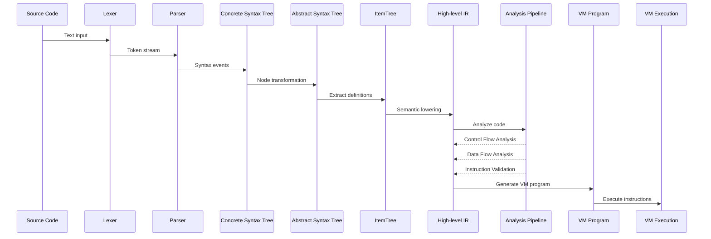
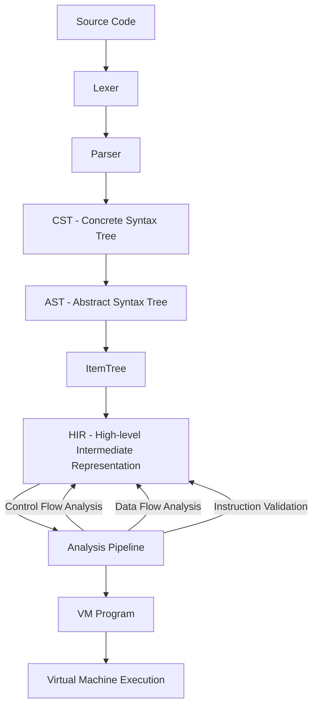

<div align="center">
  

  <!-- MIT License -->
  <a href="https://github.com/hadronomy/ram/blob/main/LICENSE">
    
  </a>

  <!-- GitHub Repo Stars -->
  <a href="https://github.com/hadronomy/ram/stargazers">
    
  </a>

  <!-- CodSpeed Badge -->
  <a href="https://codspeed.io/hadronomy/ram?utm_source=badge">
    
  </a>
  <p></p>
  <span>
    <code>RAM</code> <i>(Random Access Machine)</i> <strong>language</strong> and <strong>emulator</strong>.
  </span>
  <p></p>
  <a href="#about-this-project">About</a> •
  <a href="#usage">Usage</a> •
  <a href="#requirements">Requirements</a> •
  <a href="#license">License</a>
  <hr />

</div>

## About This Project

This project aims to develop a complete ecosystem for the Random Access Machine (RAM) model of computation. `RAM` provides both a formally defined **language** based on this model and a robust **emulator** to execute programs written in that language.

### Objectives

*   **Formal Language Definition:** Define a clear, consistent, and unambiguous specification for the RAM programming language.
*   **Accurate Emulation:** Implement an emulator that faithfully executes RAM programs according to the defined semantics.
*   **Performance:** Strive for reasonable performance in the emulator to handle non-trivial programs.
*   **Educational Resource:** Serve as a practical tool and codebase for learning about the RAM model, theoretical computer science concepts, and potentially compiler/interpreter design.
*   **(Future) LLVM Backend:** Explore replacing the emulator with an LLVM-based backend for potentially higher performance code generation.
*   **(Future) Extensibility:** Design the core components with potential future extensions in mind, such as debugging tools, visualization, or integration with other systems.

> [!CAUTION]
> This project is under heavy development
> It's not in any way stable or even functional in some cases.
> **Until the first release** the `main` branch is not guaranteed
> to work in any way.

## Usage

### Installation

RAM is available as an npm package. You can install it globally using npm, yarn, or pnpm:

```bash
# Using npm
npm install -g @ramlang/cli

# Using yarn
yarn global add @ramlang/cli

# Using pnpm
pnpm add -g @ramlang/cli
```

After installation, you should have access to the `ram` command in your terminal.

### Verifying Installation

To verify that RAM is installed correctly, run:

```bash
ram --version
```

### Available Commands

The RAM CLI provides several commands:

```bash
# Run a RAM program
ram run <program-file> [--input <values>] [--memory]

# Validate a RAM program
ram validate <program-file> [--ast] [--reprint] [--show-pipeline] [--show-cfg] [--show-hir]

# Start the Language Server Protocol (LSP) server
ram server

# Display help information
ram help

# Display version information
ram version
```

### Running a Program

To run a RAM program, use the `run` command:

```bash
# Run a program with input values
ram run program.ram --input "5 7"

# Run a program and display memory contents after execution
ram run program.ram --memory
```

### Example Program

Here's a simple RAM program that adds two numbers:

```
# Simple RAM program that adds two numbers
LOAD 1    # Load value from address 1
ADD 2     # Add value from address 2
STORE 3   # Store result in address 3
HALT      # Stop execution
```

Save this to a file (e.g., `add.ram`) and run it with:

```bash
ram run add.ram --input "5 7"
```

The program will load the value 5 from address 1, add the value 7 from address 2, and store the result (12) in address 3.

For more detailed information about the RAM language and its usage, refer to the [documentation](https://ram.hadronomy.dev/docs).

## Requirements

- mise - [Installation](https://mise.jdx.dev)
- mold - [Installation](https://github.com/rui314/mold)
- rustup/cargo - [Installation](https://rustup.rs)

`mise` Is used to manage the project dependencies and environment.
To ensure that you have the needed tools installed, run the following command:

```bash
mise trust
mise install
```

## Compilation Pipeline

The RAM compiler follows a multi-stage pipeline to transform source code into executable instructions. The following diagrams illustrate the compilation process from different perspectives.

### Sequence Diagram



### Component Graph



### Pipeline Stages

1.  **Lexer** (`ram_parser::lexer`): Initiates the process by scanning the raw source code text and breaking it down into a sequence of fundamental tokens, such as keywords, identifiers, literals, and operators.

2.  **Parser** (`ram_parser::parser`): Takes the stream of tokens generated by the lexer and applies grammatical rules (using recursive descent) to construct a structured representation of the program.

3.  **CST** (Concrete Syntax Tree): Produces a detailed, lossless tree that mirrors the original source code structure precisely, including elements like whitespace and comments. This fidelity is crucial for tasks like code formatting.

4.  **AST** (Abstract Syntax Tree): Transforms the CST into a more abstract representation, discarding purely syntactic details and focusing on the program's logical structure and meaning.

5.  **ItemTree** (`hir_def::item_tree`): Creates a higher-level view by extracting key definitions like modules and labels from the AST, essentially providing a structural map or outline of the program.

6.  **HIR** (High-level Intermediate Representation): Elevates the AST into a semantically richer form. This representation incorporates resolved names, initial type information, and other details necessary for deeper analysis.

7.  **Analysis Pipeline** (`hir_analysis::pipeline`): Executes a sequence of analysis passes over the HIR to validate the program's correctness and gather further insights:
    *   **Control Flow Analysis**: Maps out the possible execution paths within the program.
    *   **Data Flow Analysis**: Tracks the origin, movement, and usage of data throughout the code.
    *   **Instruction Validation**: Verifies that all instructions are well-formed and used according to the language rules.

8.  **VM Program** (`ram_vm::program`): Translates the analyzed HIR into a format specifically designed for execution by the target virtual machine.

9.  **Virtual Machine Execution** (`ram_vm::vm`): The final stage where the VM interprets the generated program, executing instructions sequentially and manipulating the virtual machine's memory and registers to run the code.

## License

This project is licensed under the MIT License - see the [LICENSE](LICENSE) for details.
